# 🧩 Building Startup Analytics

Building analytics process for startup: infrastructure, dashboards, A/B testing, forecasting, automated reports, and anomaly detection.

**📖 For comfortable reading:** [Web version](https://pavelgrigoryevds.github.io/building-startup-analytics/)

## 📑 Contents

- [🛠️ Tech Stack \& Methods](#tech-stack-methods)
- [📌 Project Overview](#project-overview)
- [🗃️ Data Source](#data-source)
- [📊 Project Components & Implementation](#project-components)
  - [1. Building Analytical Database](#analytical-database)
  - [2. Product Dashboard](#product-dashboard)
  - [3. Product Metric Deep Dive](#metric-deep-dive)
  - [4. A/B Testing](#ab-testing)
  - [5. Metric Forecasting](#metric-forecasting)
  - [6. Automated Daily Reports](#automated-reporting)
  - [7. Alert System](#alert-system)
- [🎯 Goal Delivered](#goal-delivered)
- [📜 License](#license)
  
---

## 🛠️ Tech Stack & Methods

**Stack:**

- **Data & DB:** `Python` `Pandas` `ClickHouse`
- **Viz & BI:** `Superset` `Yandex DataLens` `Plotly`
- **ML & Stats:** `StatsModels` `SciPy` `Pingouin` `Uber Orbit`
- **Automation:** `Apache Airflow` `Telegram API`

**Methods:**

- **Data Infrastructure Design:**
  - Star schema modeling, ETL pipeline development, and data quality validation
- **Product Analytics:**
  - Retention analysis, cohort analysis, and engagement metrics tracking
- **Business Intelligence:**
  - Real-time dashboard design, KPI definition, and self-service reporting implementation
- **Statistical Hypothesis Testing:**
  - A/A and A/B test analysis, sample size calculation, and statistical power analysis
- **Time Series Forecasting:**
  - Bayesian structural models, trend/seasonality decomposition, and model validation
- **Anomaly Detection:**
  - MAD-based outlier detection, alert threshold optimization, and real-time monitoring
- **Automation Engineering:**
  - DAG orchestration, API integration, and scheduled reporting systems
- **Monte Carlo Simulation:**
  - Statistical power estimation and sample size determination through simulation
  
[⬆ back to contents](#contents)

---

## 📌 Project Overview

- This project demonstrates the implementation of a complete product analytics system for an early-stage startup that has developed an application merging a messenger with a personalized news feed. 
- In this ecosystem, users can browse and interact with posts (views, likes) while simultaneously communicating with each other through direct messages. 
- The core challenge was to build the entire analytical infrastructure from scratch to understand user behavior across both features and enable data-driven decision-making.

**Project Goal:**

- **Build Data Infrastructure**
  - Create scalable analytical database for product metrics
  - Establish single source of truth for user behavior data

- **Enable Product Analytics**
  - Develop interactive dashboards for real-time monitoring
  - Implement retention analysis and engagement tracking

- **Establish Experimentation**
  - Build complete A/B testing pipeline for feature validation
  - Ensure statistical reliability of experiment results

- **Create Forecasting System**
  - Develop predictive models for key business metrics
  - Enable proactive anomaly detection and planning

- **Automate Business Reporting**
  - Implement daily automated reports to Telegram
  - Build comprehensive stakeholder communication system

- **Establish Proactive Monitoring**
  - Build real-time alerting system for metric anomalies
  - Implement 24/7 monitoring with immediate notifications

- **Drive Business Decisions**
  - Translate data insights into product recommendations
  - Establish continuous monitoring processes

**Expected Outcome:**

- A complete analytics ecosystem that provides real-time business visibility, enables data-driven product decisions, and automates stakeholder reporting through reliable, scalable data infrastructure.

[⬆ back to contents](#contents)

---

## 🗃️ Data Source

The analysis uses data from the product database in ClickHouse, which consists of two main tables:

- **`feed_actions`** - tracks user interactions with the news feed
- **`message_actions`** - records messaging activity between users

[⬆ back to contents](#contents)

## 📊 Project Components & Implementation

### 1. Building Analytical Database

[📓 View Notebook with Full Analysis](./building_startup_analytics/1_data_infrastructure/analytical_database.ipynb)

**Context:**

- Startup's messenger and news feed app generates extensive user interaction data. To enable product monitoring, we need to build an optimized analytical database that will power our business intelligence dashboards.

**Objectives:**

- To design and implement a performant database structure that serves as the backend for product dashboards, enabling tracking of key metrics like DAU, retention, and engagement across both messaging and feed features.

**Key Achievements:**

- **Star Schema Designed:** Developed a star schema for the analytical database
- **Metric Queries Created:** Built queries to the product database for calculating required metrics for the analytical database
- **Star Schema Tables Implemented:** Created all necessary tables for the star schema in the analytical database
- **Data Migration Completed:** Extracted required data from the product database and loaded it into the analytical database
- **Dashboard Optimization:** Created materialized views to optimize dashboard performance
- **Automation Pipeline Built:** Developed Airflow DAG for daily incremental data loading for yesterday's data
- **Goal Achieved:** Established analytical database and ETL process for continuous data updates

**Business Impact:**

- Created optimized analytical database that serves as foundation for all downstream reporting and analytics, enabling faster data processing and reusable data infrastructure.

**Final Schema for the Analytical Database:**

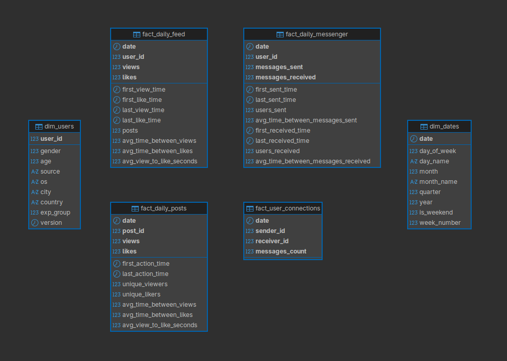

[⬆ back to contents](#contents)

---

### 2. Product Dashboard

[📓 View Notebook with Full Analysis](./building_startup_analytics/2_product_dashboard/product_dashboard.ipynb)

[👉 Feed & Messenger Performance Dashboard](https://datalens.yandex/w5blxgwqvb4uh)

**Context:**

- With the analytical database in place, the next critical step is to provide the product and management teams with intuitive, self-service access to key metrics through a comprehensive dashboard.

**Objectives:**

- To design and implement an interactive product dashboard in Yandex DataLens that enables monitoring of user engagement, retention, and growth metrics across both messaging and news feed features.

**Key Achievements:**

- **Dashboard Canvas Completed:** Defined business questions, key metrics, and target audience for the product dashboard
- **Dashboard Layout Designed:** Created comprehensive dashboard mockup with visualization types and layout structure
- **Yandex DataLens Dashboard Implemented:** Built and deployed interactive dashboard in Yandex DataLens
- **Dashboard Documentation Written:** Created comprehensive documentation including filter definitions and metric explanations

**Business Impact:** 

- Empowered non-technical teams with self-service analytics capabilities, significantly reducing dependency on data team for routine metric monitoring.

**Dashboard Screenshots:**  

Here are the key screenshots of the implemented dashboard:

#### 📱 App Overview Tab

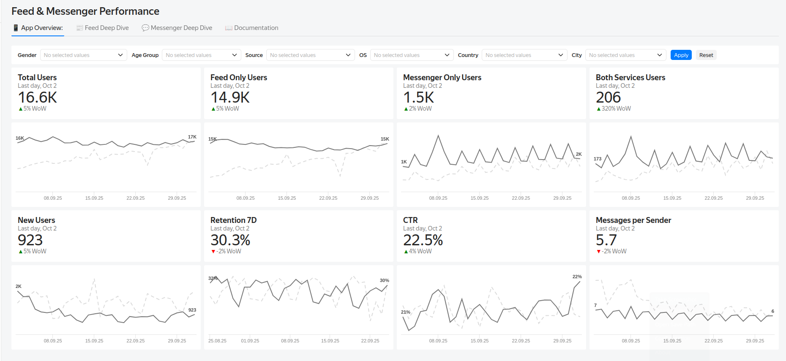
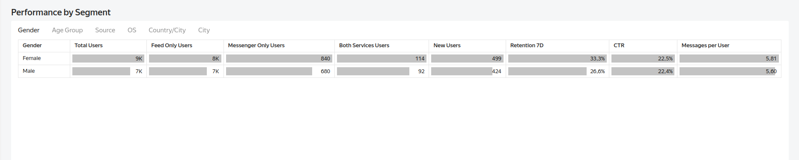

#### 📰 Feed Deep Dive Tab

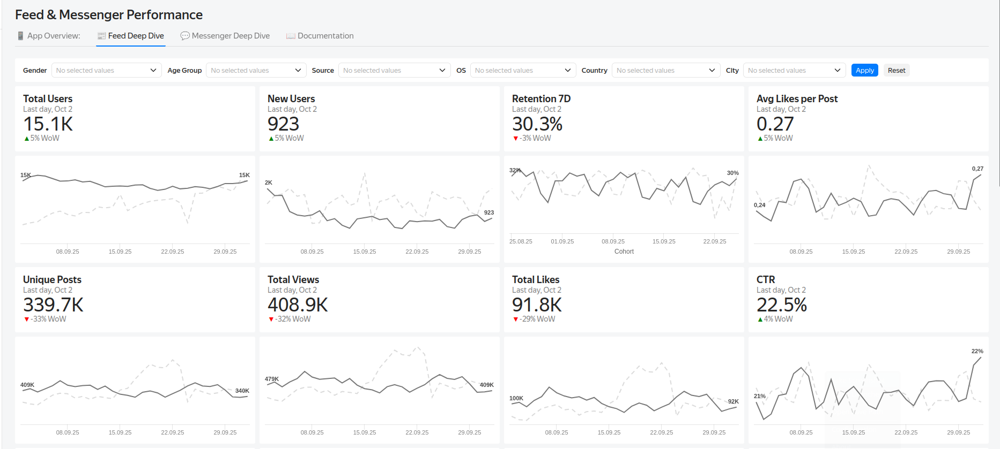
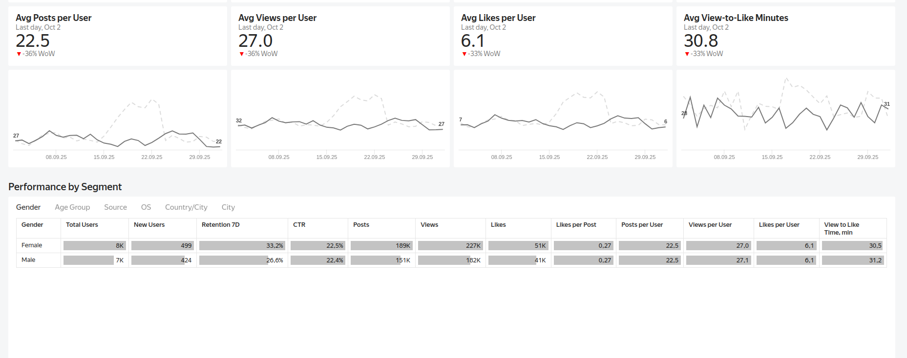

#### 💬 Messenger Deep Dive Tab

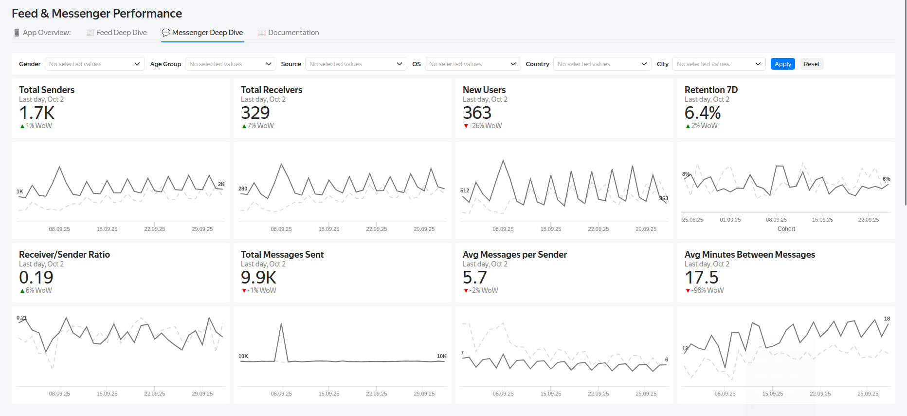
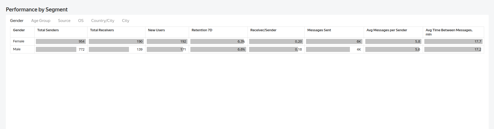

#### 📖 Documentation

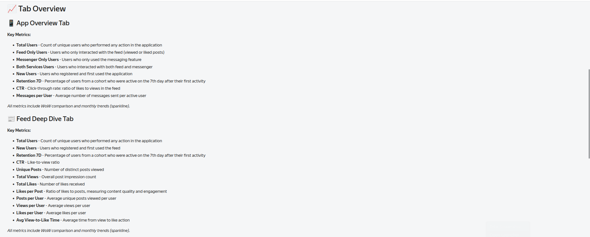
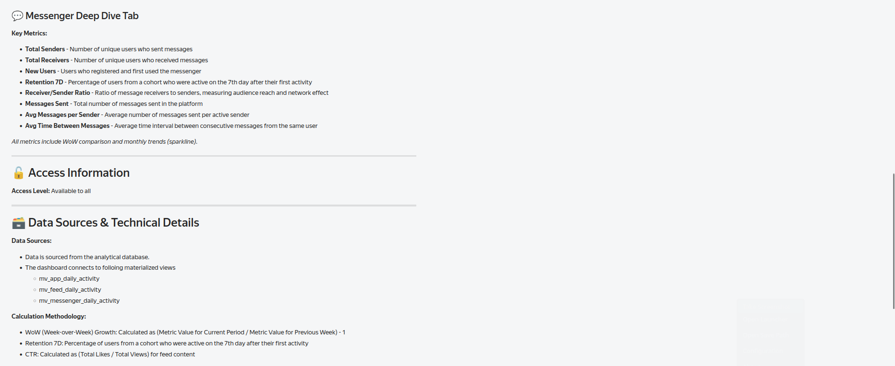

[⬆ back to contents](#contents)

---

### 3. Product Metric Deep Dive

[📓 View Notebook with Full Analysis](./building_startup_analytics/3_metric_deep_dive/metric_deep_dive.ipynb)

**Context:**

- Over the past several days, our startup experienced two significant events that impacted user metrics. 
- First, marketing launched a major advertising campaign that brought a substantial number of new users to the application. 
- Second, we observed a sharp, unexpected drop in active audience on a specific day, requiring immediate investigation.

**Objectives:**

To conduct a deep dive analysis addressing three critical business questions:
1. Analyze retention patterns of users acquired through the advertising campaign to understand their long-term engagement and value
2. Investigate the sudden audience drop by identifying users who experienced issues with the news feed and determining common characteristics among them
3. Build weekly audience segmentation to track user lifecycle and identify trends in new, retained, and churned users

**Key Achievements:**

- **Retention Analysis Completed:** 
  - Conducted comprehensive cohort analysis of advertising campaign users versus organic users
- **User Segmentation Identified:** 
  - Segmented and analyzed users who experienced news feed access issues
- **Root Cause Investigation:** 
  - Identified common characteristics and potential technical factors behind the audience drop
- **User Lifecycle Tracking Implemented:** 
  - Built ClickHouse query and Superset visualization for monitoring New, Retained, and Churned user cohorts
- **Data Products Delivered:** 
  - Created Superset dashboards for ongoing monitoring of retention patterns and user engagement issues
- **Goal Achieved:** 
  - Provided data-driven insights that enabled marketing to optimize campaign strategies and engineering to address critical technical issues
  
**Key Findings:**

- Advertising Campaign Analysis
  - Campaign successfully attracted large volume of new users, significantly exceeding previous acquisition rates
  - Initial engagement metrics showed no significant difference from organic users
  - Critical Issue: Day-1 retention rate for campaign users was substantially lower than historical Friday cohorts

- Audience Drop Investigation
  - Significant drop in feed engagement occurred on August 24th
  - Affected Areas: Moscow, St. Petersburg, Yekaterinburg, Novosibirsk showed concentrated impact
  - Isolated Issue: Messenger functionality remained unaffected in these cities
  
**Key Recommendation:**  

- Implement more targeted advertising based on analysis of existing active user profiles rather than broad audience targeting
- Investigate technical infrastructure in affected regions and implement redundancy measures to prevent future service disruptions

**Business Impact:**

- Provided actionable insights to optimize user acquisition strategies and improve product experience based on actual user behavior patterns.

**Dashboard Screenshots for Advertising Campaign Analysis**

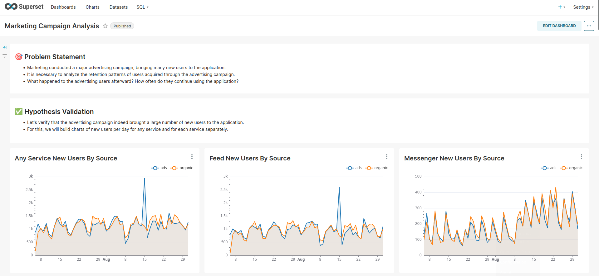
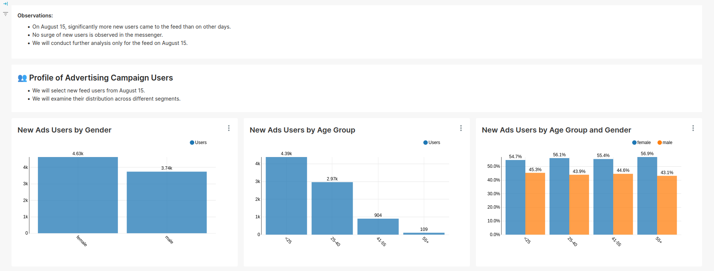
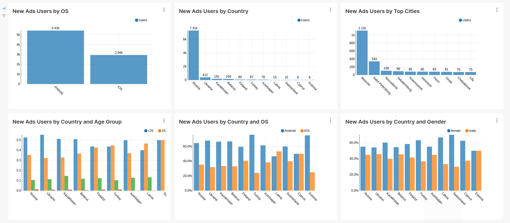
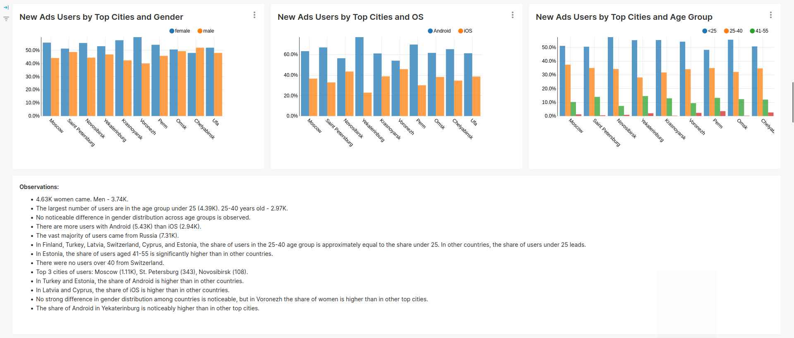
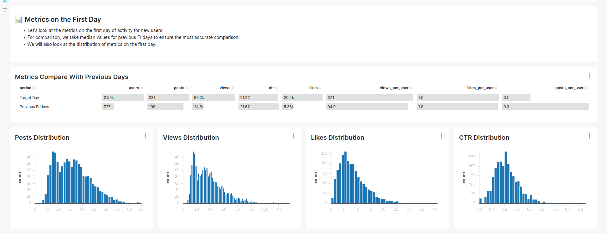
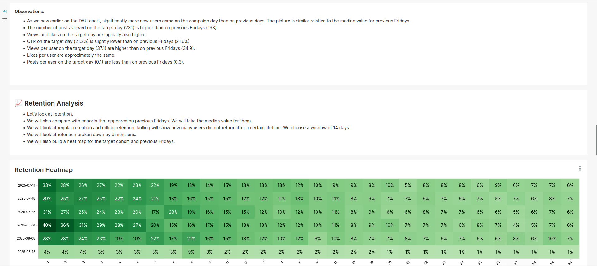
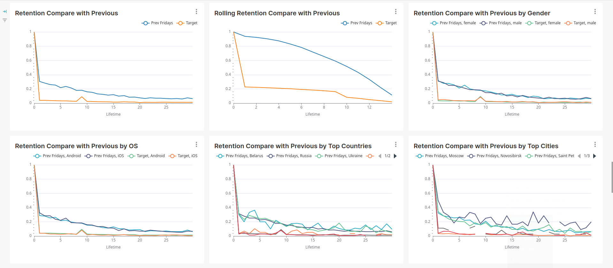
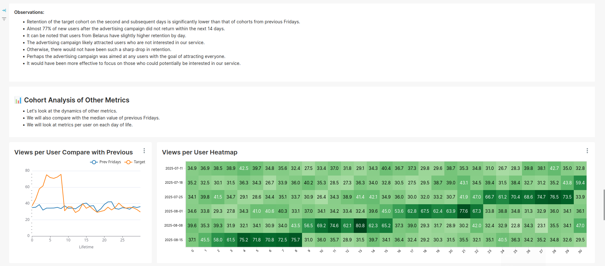
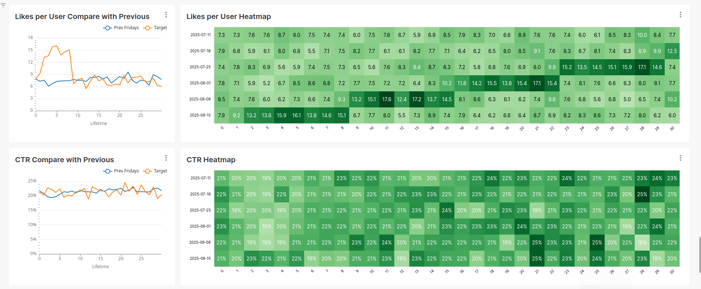
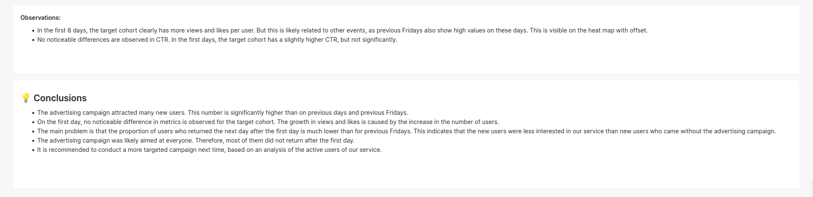

**Dashboard Screenshots for Audience Drop Investigation**

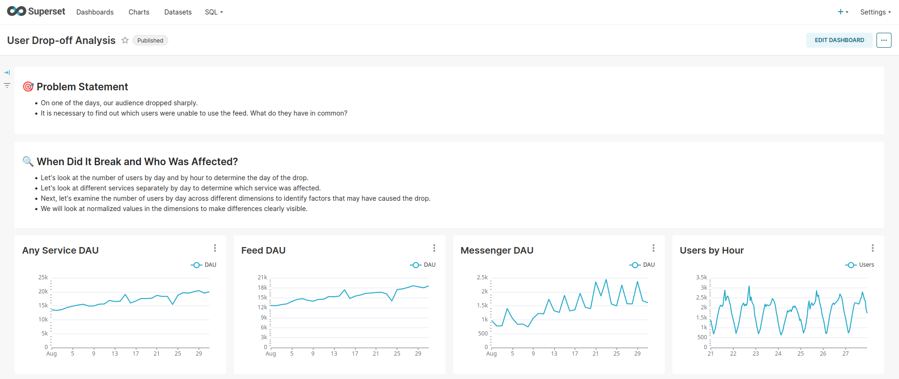
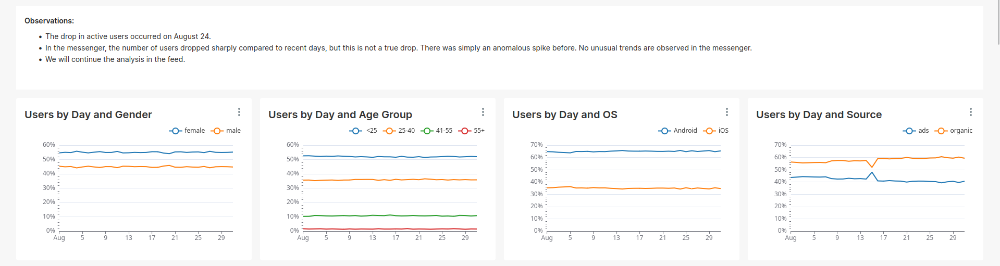
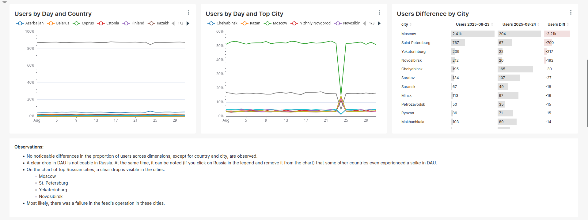
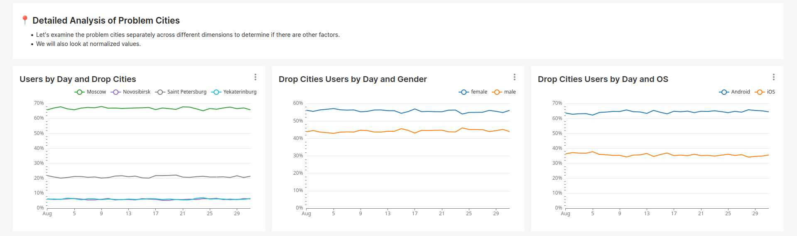
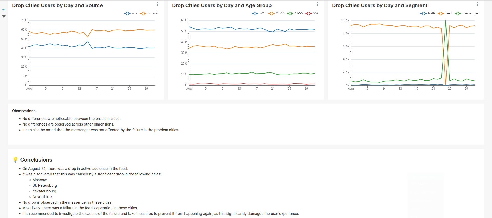

**Dashboard Screenshots for Users Decomposition**

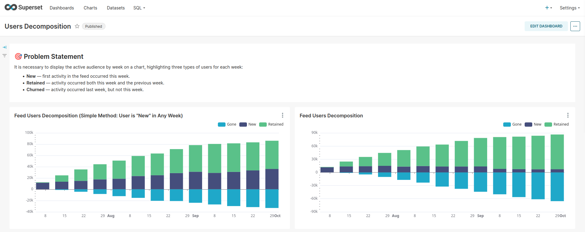
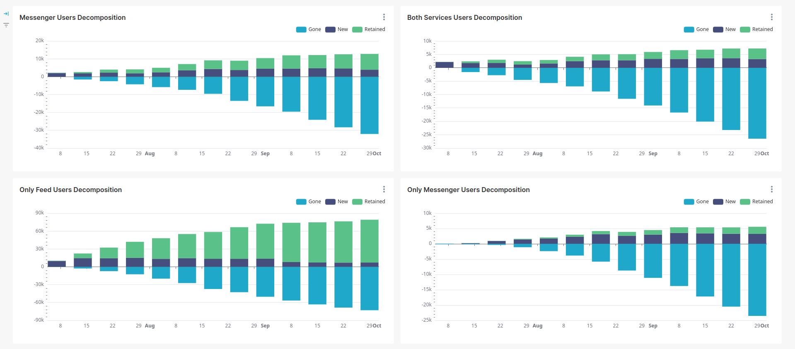

[⬆ back to contents](#contents)

---

### 4. A/B Testing

[📓 View Notebook with Full Analysis](./building_startup_analytics/4_ab_testing/ab_testing.ipynb)

**Context:**

- The ML team has developed new algorithms for news feed recommendations. 
- It is expected that these new algorithms will make users happier and the product more convenient/pleasant to use. 
- This needs to be verified.
- The ML team told us: "The recommendations make posts more interesting."

**Algorithms Under Test:**
1. **Similar to Liked Posts**: Shows users posts most similar to those they've liked
2. **Similar User Preferences**: Shows users posts that similar users have liked

**Objectives:**

- To design and execute a complete A/B testing pipeline that validates whether the new recommendation algorithms increase user engagement.
- To provide data-driven recommendations on rolling out the algorithms to all users.

**Key Findings:**

Hypothesis 1 ("Similar to Liked Posts"):

- **The new algorithm should not be rolled out to all users.**
- The analysis revealed anomalies (bimodality) in the test group, indicating a high probability of technical problems during the experiment.
- The main argument is that bimodality was present for the first 6 days but disappeared on the last day.
- If the impact on the test group was consistent for all 7 days, this could not have happened. This is a clear signal of technical issues.

Hypothesis 2 ("Posts Liked by Similar Users"):

- **Limited rollout recommended**
- Statistically significant CTR improvement observed (+0.0164)
- No distribution anomalies detected - results are reliable
- Clean data quality with consistent patterns across all test days

**Key Recommendations:**

For Hypothesis 1:
- Investigate the causes of bimodality in the test group.
    - It strongly resembles technical problems, given the presence of two modes around 10% and 30%.
    - Meanwhile, the historical CTR is around 20%.
    - This is a large deviation that is unlikely to occur under normal conditions.
- Take into account that bimodality was absent on the last test day. This might help in identifying the problem.

For Hypothesis 2:
- Gradually roll out the "Posts Liked by Similar Users" algorithm to increasingly larger audience segments
- Maintain close monitoring of key metrics and user behavior throughout the rollout process

**Business Impact:**

- Enabled data-driven feature rollout decisions, preventing potential negative user experience and identifying opportunities for engagement improvement.

[⬆ back to contents](#contents)

---

### 5. Metric Forecasting

[📓 View Notebook with Full Analysis](./building_startup_analytics/5_metric_forecasting/metric_forecasting.ipynb)

**Context:**

- Recently, we've been receiving increasing complaints about application lag and performance issues. 
- As user activity grows, server load intensifies, requiring proactive capacity planning. 
- While this is primarily a DevOps and engineering challenge, accurate forecasting of user activity is crucial for anticipating server demands and preventing future performance degradation.

**Objectives:**

- To build reliable forecasting models that predict user activity patterns for the upcoming month, enabling proactive server capacity planning and preventing application performance issues.

**Key Achievements:**

- **Metric Selection & Analysis:** 
  - Selected total actions (feed + messenger) as primary load metric and total DAU as stability metric; conducted comprehensive EDA on 2 months of historical data
- **Model Development & Validation:**
  -  Tested ETS, LGT, DLT, and KTR models with multiple estimators; performed rigorous backtesting with expanding and rolling windows
- **Parameter Optimization & Quality Assessment:** 
  - Conducted grid search for optimal model parameters; evaluated models using SMAPE, MAE, and information criteria
- **Forecasting Strategy:** 
  - Established 7-day forecasting as optimal horizon given data constraints; identified key limitations and model interpretation guidelines

**Key Findings:**

Total DAU Forecasting

- **Best Model:** 
  - DLT with MAP estimator, linear trend, no regressors or regularization
- **Accuracy:** 
  - 3.9% SMAPE error (excellent result given limited data)
- **Key Insight:** 
  - Linear trend outperforms log-linear
  - MAP estimators work better than MCMC with small datasets

Total Actions Forecasting  
- **Best Model:** 
  - DLT with MAP estimator, linear trend, no regressors
- **Accuracy:** 
  - 21.4% SMAPE error (reasonable given metric volatility)
- **Key Insight:** 
  - Total actions are more volatile but crucial for server load planning

**Key Recommendations**

Immediate Actions
- Implement weekly forecasting using the selected DLT models for both metrics
- Use total DAU for stable capacity planning and total actions for peak load estimation
- Maintain separate forecasts for feed and messenger components

Strategic Recommendations
- **Data Collection:** 
  - Continue accumulating historical data for improved model accuracy
- **Model Retraining:** 
  - Schedule monthly model re-evaluation as data volume increases
- **Gradual Expansion:** 
  - Consider extending forecast horizon to 2 weeks once 3+ months of data are available
  
**Business Impact:**

- Supported infrastructure planning and resource allocation through reliable activity predictions, contributing to stable application performance.

[⬆ back to contents](#contents)

---

### 6. Automated Daily Reports

[📓 View Notebook with Full Analysis](./building_startup_analytics/6_automated_reporting/automated_reporting.ipynb)

**Context:**

- As our application grows, stakeholders need consistent, automated insights into product performance. 
- Currently, manual reporting processes are time-consuming and lack standardization.
- This project replaces manual reporting with an automated pipeline that generates  insights and sends them straight to team chat, ensuring consistent access to key metrics.

**Objectives:**

- To build a complete automated pipeline that generates daily product reports and delivers them to a Telegram chat, providing stakeholders with regular business insights without manual intervention.

**Key Achievements:**

- **Data Pipeline Development:** 
  - Built SQL queries to extract and calculate key product metrics from ClickHouse database
- **Automation Framework:** 
  - Created Airflow DAG for scheduled daily execution with comprehensive error handling
- **Chat Delivery System:** 
  - Integrated Telegram API for automated report distribution directly to team chat
- **Business Reporting:** 
  - Designed comprehensive visualizations covering both application-wide and feature-specific metrics
- **Stakeholder Focus:** 
  - Developed business-ready reports that answer key product performance questions

**Business Impact:**

- Streamlined stakeholder communication and ensured consistent access to key business metrics without manual intervention.

**Report Screenshots**

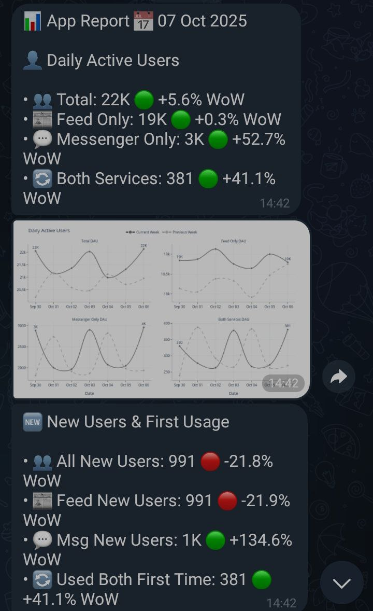
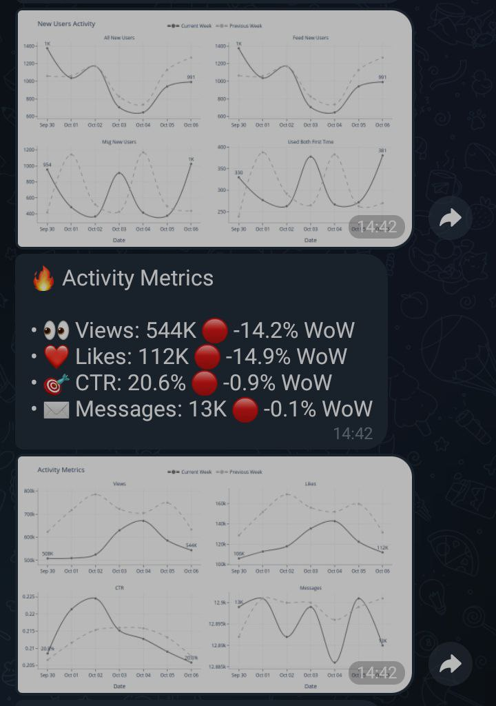
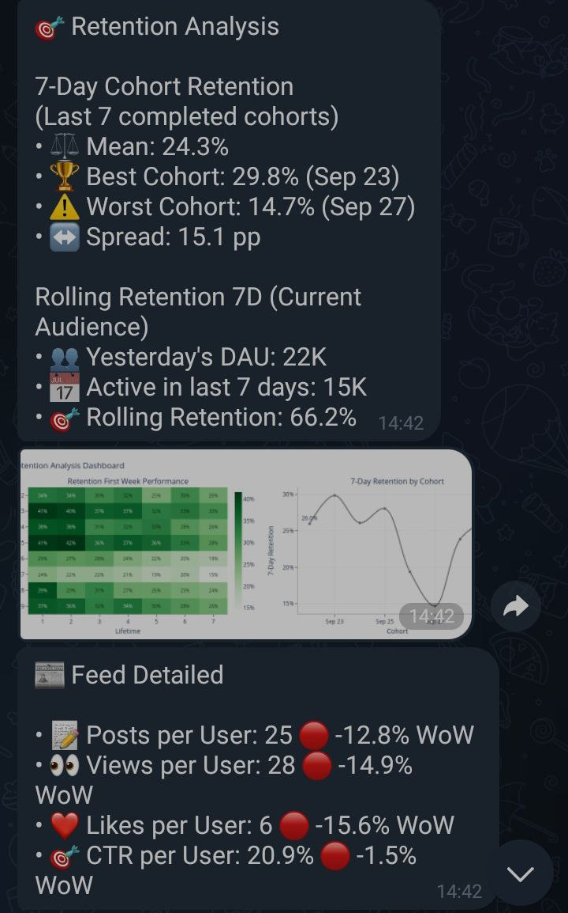
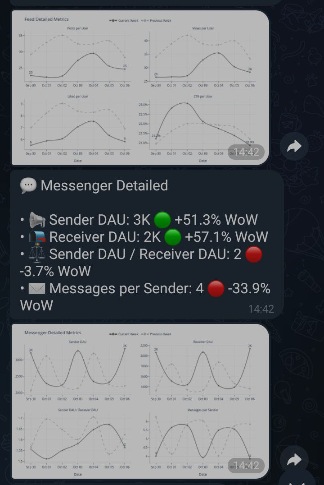
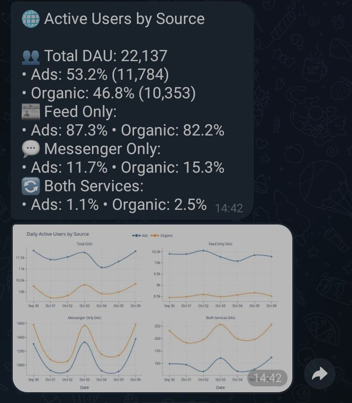

[⬆ back to contents](#contents)

---

### 7. Alert System

[📓 View Notebook with Full Analysis](./building_startup_analytics/7_anomaly_detection/alert_system.ipynb)

**Context:**

- To proactively identify issues before they impact users, we need a system that continuously monitors key product metrics and alerts the team about anomalies. 
- This project implements an automated alert system that checks critical metrics every 15 minutes and sends immediate notifications when deviations are detected.

**Objectives:**

- To build a robust anomaly detection system that monitors key product metrics in real-time, automatically alerts the team via Telegram when anomalies occur, and provides actionable insights for rapid investigation.

**Key Achievements:**

- **SQL Queries Developed:** 
  - Created optimized queries to extract and calculate key metrics from ClickHouse database
- **Airflow DAG Implemented:** 
  - Built automated pipeline for continuous 15-minute monitoring and alert generation  
- **Anomaly Detection Engine:** 
  - Successfully implemented MAD-based statistical method for identifying metric deviations
- **Configurable System:** 
  - Built flexible detection with adjustable sensitivity thresholds
- **Real-time Monitoring:** 
  - Established 24/7 tracking of feed and messenger metrics (DAU, views, likes, CTR, messages)
- **Automated Alert System:** 
  - Deployed Telegram integration for immediate notification delivery

**Business Impact:**

- Established proactive monitoring system that enables rapid response to critical issues before they escalate to affect user experience.

**Anomaly Alert Screenshots**

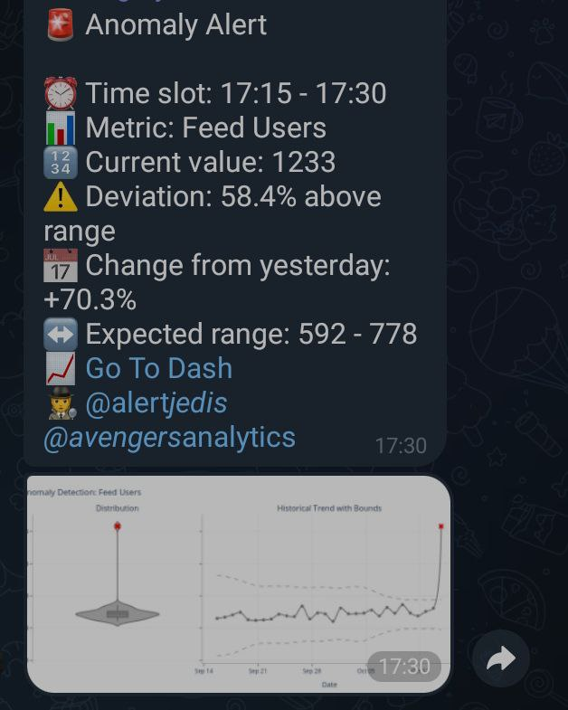
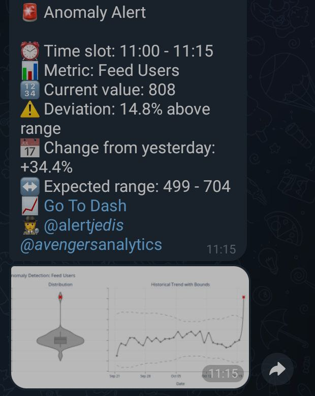

[⬆ back to contents](#contents)

---
 

## 🎯 Goal Delivered

Successfully implemented a complete analytics workflow from data collection to actionable business insights.

- **Centralized Data Foundation** with optimized analytical database
- **Comprehensive Monitoring** through interactive dashboards and alerts
- **Automated Intelligence** with daily reporting and anomaly detection
- **Experimental Framework** for data-driven feature validation
- **Predictive Capabilities** enabling proactive planning and optimization

[⬆ back to contents](#contents)

--- 

## 📜 License  

This analysis is shared under [MIT License](LICENSE).  
